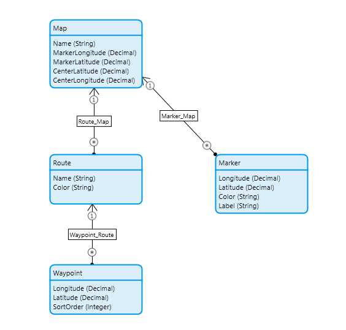

# Openstreetmap
Mendix openstreetmap widget built with leaflet 
based on https://react-leaflet.js.org/

**Overview**

The **OpenStreetMap Widget** enables you to integrate dynamic **Leaflet-based maps** into your Mendix web applications.  
It allows displaying interactive maps, routes, and markers using Mendix data sources, with full customization of zoom levels, dimensions, and event actions.

Use it to visualize paths, locations, and routes directly from your domain model in a clean, low-code way.

**Features**

- Display **OpenStreetMap** tiles using **Leaflet.js**.
- Show **multiple routes** with configurable colors.
- Render **waypoints** and **markers** linked to your data model.
- Support for **click actions** and **marker interactions**.
- Configurable **map dimensions**, **zoom**, and **scroll wheel zoom**.
- React-client
- Openstreetmap license
- Small footprint, only 250KB

**Usage**

- Add the **OpenStreetMap** widget to a **data view** or **context page** in Mendix Studio Pro.
- Configure the **required data sources** for routes, points, and (optionally) markers.
- Bind latitude/longitude attributes from your entities.
- Set zoom level, width, and height to customize appearance.
- (Optional) Configure actions for map click or marker click events.

**Configuration**

**General**

| Property | Type | Required | Default | Description |
| --- | --- | --- | --- | --- |
| Zoom (zoom) | Expression (Integer) | ✅ | 13 | Map zoom level (0 = world, 18 = detailed). |
| Center latitude (centerlatitude) | Expression (Decimal) | ❌ | — | Initial map center latitude. |
| Center longitude (centerlongitude) | Expression (Decimal) | ❌ | — | Initial map center longitude. |
| Height (height) | Expression (String) | ✅ | 80vh | Map height (use px, %, or viewport height units). |
| Width (width) | Expression (String) | ✅ | 100% | Map width (use px, %, or viewport width units). |
| Scroll wheel zoom (scrollwheelzoom) | Boolean | ✅ | false | Enables zooming with mouse scroll wheel. |

* * *

**Routes**

| Property | Type | Required | Description |
| --- | --- | --- | --- |
| Routes entity (routesentity) | Data source (List) | ❌ | Data source containing route records. |
| Color (routecolor) | Expression (String) | ❌ | Defines route color per record. |

* * *

**Points (Waypoints)**

| Property | Type | Required | Description |
| --- | --- | --- | --- |
| Waypoints entity (pointsentity) | Data source (List) | ❌ | Data source for waypoint records. |
| Association to routes (pointstoroute) | Association | ❌ | Links waypoints to route records. |
| Longitude attribute (lonattribute) | Attribute (Decimal) | ❌ | Attribute containing longitude values. |
| Latitude attribute (latattribute) | Attribute (Decimal) | ❌ | Attribute containing latitude values. |
| Order attribute (pointsortorderattr) | Attribute (Decimal / Integer) | ❌ | Attribute for sorting waypoints in route order. |

* * *

**Events**

| Property | Type | Required | Description |
| --- | --- | --- | --- |
| On click (onClickAction) | Action | ❌ | Triggered when the user clicks the map. |

* * *

**Markers**

| Property | Type | Required | Description |
| --- | --- | --- | --- |
| Markers entity (markersentity) | Data source (List) | ❌ | Data source for map markers. |
| Longitude attribute (markerlonattr) | Attribute (Decimal) | ❌ | Longitude for each marker. |
| Latitude attribute (markerlatattr) | Attribute (Decimal) | ❌ | Latitude for each marker. |
| Color attribute (markercolorattr) | Attribute (String) | ❌ | Marker color (options: blue, gold, red, green, orange, yellow, violet, grey, black). |
| Label attribute (markerlabelattr) | Attribute (String) | ❌ | Label text for the marker. |
| On click marker (markerAction) | Action | ❌ | Action triggered when a marker is clicked. |

* * *

**Add Marker (on Map Click)**

| Property | Type | Required | Description |
| --- | --- | --- | --- |
| Longitude attribute (lonclickattr) | Attribute (Decimal) | ❌ | Attribute to store longitude when user adds a marker. |
| Latitude attribute (latclickattr) | Attribute (Decimal) | ❌ | Attribute to store latitude when user adds a marker. |

* * *

**Example Domain Model**

* * *

**Tips**

*   Use **Decimal** attributes for coordinates to ensure precision.
*   To dynamically add markers, bind marker click latitude and longitude to a persistable entity.
*   Zoom, Center, Routes and markers can be refreshed using microflows for live updates.
*   If you have multiple routes, use routecolor to differentiate them visually.

* * *

**Dependencies**

*   **Leaflet.js**  https://react-leaflet.js.org/
*   **Openstreemap** https://www.openstreetmap.org/copyright 
*   Mendix **9.0+** or higher (recommended)
*   Supported platform: **Web**

* * *

* * *

**License**

Creative Commons © 2025 — _LowCodeConnect_  

* * *

